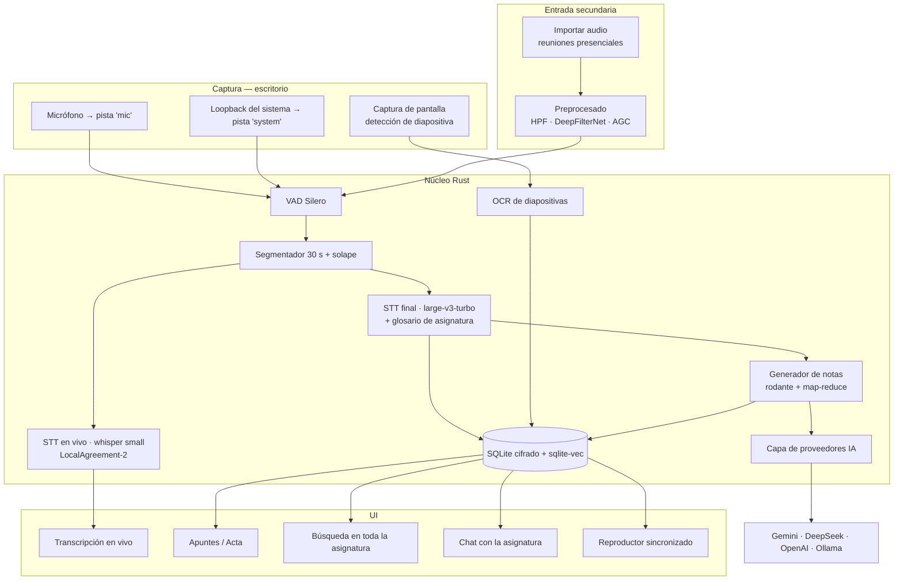

# 01 — Arquitectura

## 1. Perfil de uso real

Esto no es una app genérica de reuniones. El caso concreto define el diseño entero:

| Uso | Frecuencia | Entorno | Plataforma |
|---|---|---|---|
| **Clases universitarias online** | ~10 h/semana | Meet / Zoom / Teams | **Escritorio** |
| **Reuniones con clientes y prospectos** | Puntual | Meet / Zoom | **Escritorio** |
| Reuniones presenciales | Ocasional | Sala, cara a cara | Móvil o importación |
| Llamadas telefónicas | **Nunca** | — | Fuera de alcance |

**Volumen:** ~150 h por semestre. **Presupuesto:** de estudiante → todo lo posible en local y
gratis. **Salida:** apuntes para las clases, actas para los clientes.

### Tres consecuencias que ordenan todo el proyecto

**1. El escritorio es la plataforma principal, no un procesador auxiliar.**
El 95 % de las sesiones ocurren delante del PC, con el audio llegando por el loopback del
sistema. El móvil pasa a ser un accesorio para el caso ocasional presencial.

**2. El audio deja de ser el gran riesgo.**
Capturar el loopback de Meet o Zoom da audio digital limpio, sin distancia, sin reverberación y
sin ruido de sala. Whisper rinde en su mejor escenario. La cadena de denoise sigue existiendo,
pero para el caso presencial, que es minoritario. Esto reduce el riesgo del proyecto de forma
drástica frente a un diseño orientado a aulas físicas.

**3. Aparecen dos capacidades que en presencial no existían:**
- **Transcripción en vivo útil.** Estás delante del PC durante la clase: poder releer lo que se
  dijo hace diez minutos, o buscar un término mientras el profesor sigue hablando, tiene valor
  real. En una grabadora de bolsillo no lo tenía.
- **Captura automática de diapositivas.** El profesor comparte pantalla. Detectando el cambio de
  diapositiva se guarda una captura anclada al segundo exacto, y los apuntes salen con las
  diapositivas intercaladas en su sitio. Es la diferencia entre una transcripción y unos
  apuntes de verdad.

---

## 2. Captura

### 2.1 Caso principal: sesiones online en el escritorio

Se captura simultáneamente:

- **Micrófono** → tú
- **Loopback del sistema** → el profesor o el cliente, salga de Meet, Zoom, Teams o el navegador

| SO | API | Notas |
|---|---|---|
| Windows | WASAPI *loopback* (`AUDCLNT_STREAMFLAGS_LOOPBACK`) | Mezcla del sistema |
| Windows 10 2004+ | *Process loopback* (`VIRTUAL_AUDIO_DEVICE_PROCESS_LOOPBACK`) | Solo el proceso de Meet/Zoom. **Preferible**: no graba tu música ni las notificaciones |
| Linux (PipeWire) | Nodos `monitor` vía `pipewire-rs` | Estándar en distros modernas |
| Linux (PulseAudio) | Fuentes `.monitor` | Fallback para sistemas antiguos |
| Linux (Wayland/Flatpak) | Portal `xdg-desktop-portal` | Requiere consentimiento explícito |

**Dos pistas separadas, nunca una mezcla.** De ahí salen tres cosas gratis:

1. **Diarización exacta** sin modelo ni coste: pista `mic` = tú, pista `system` = el otro.
2. **Mejor transcripción**: cada pista se transcribe por separado, sin voces solapadas.
3. **Control independiente**: puedes silenciar tu pista en un acta de cliente, o subir solo la
   del profesor si tu micro captó ruido de casa.

Detalles que importan en sesiones de dos horas:

- **Persistencia inmediata.** Escribir a disco antes de procesar nada. Si la app muere en el
  minuto 90, la clase no se pierde. Opus 24 kbps × 2 pistas ≈ **11 MB/hora**.
- **Reloj monótono común** para ambas pistas. Si derivan, los hablantes se desalinean y los
  apuntes atribuyen frases al interlocutor equivocado.
- **Detección de la app activa.** Si hay una ventana de Meet, Zoom o Teams abierta, proponerla
  automáticamente. Un botón menos antes de empezar la clase.

### 2.2 Captura automática de diapositivas

El profesor comparte pantalla; esa información se pierde por completo si solo grabas audio. En
clases con fórmulas, diagramas o código, la transcripción sola es insuficiente: "como veis
aquí" no significa nada dentro de un texto.

**Mecanismo:**

```
Cada 2 s → captura de la ventana compartida a baja resolución
         → hash perceptual (dHash) de la región central estable
         → distancia de Hamming con el hash anterior
              ├─ < umbral  → misma diapositiva, descartar
              └─ ≥ umbral  → diapositiva nueva:
                              guardar captura a resolución completa
                              anclar a ts_ms
                              OCR → texto indexable + términos al glosario
```

Puntos finos que deciden si esto funciona o molesta:

- **Ignorar la miniatura de la webcam y el cursor.** Comparar solo una región central estable,
  o exigir que el cambio afecte a un porcentaje mínimo del área. Si no, cada movimiento de la
  cara del profesor cuenta como diapositiva nueva.
- **Estabilización temporal.** Confirmar el cambio en dos capturas consecutivas antes de
  guardar; así las transiciones y animaciones no generan cuatro capturas de la misma lámina.
- **Deduplicación al final.** Si el profesor vuelve a una diapositiva anterior, referenciar la
  captura existente en lugar de duplicarla.
- **Solo mientras grabas**, con indicador visible. Capturar la pantalla es intrusivo y debe
  serlo de forma evidente.

Coste: una clase de 2 h con 60 diapositivas ≈ 30–60 MB en WebP. Crates: `xcap` para captura
multiplataforma, `image` + `img_hash` para el hashing.

El OCR alimenta dos cosas: la búsqueda (encontrar la diapositiva donde salía cierta ecuación) y
el **glosario de la asignatura** (§2.4), porque las diapositivas están llenas de la terminología
exacta que Whisper necesita conocer.

### 2.3 Caso secundario: reuniones presenciales

Aquí sí aparece el problema acústico: distancia al interlocutor, reverberación de la sala, ruido
de fondo, varias personas alrededor del micrófono.

**Dos vías, y la primera es suficiente para empezar:**

1. **Importar un archivo de audio.** Grabas con la grabadora nativa del móvil y arrastras el
   archivo a la app. Cero código de móvil, disponible desde el primer día, y cubre el caso
   ocasional sin construir nada.
2. **App Android propia**, si la frecuencia lo justifica: grabación en *foreground service*,
   transferencia automática al PC por LAN, marcadores durante la reunión.

**Cadena de preprocesado**, que solo se activa en este caso:

```
PCM original (se guarda intacto, siempre)
   └─> copia de trabajo
         ├─ filtro paso-alto 80 Hz       → retumbe de climatización
         ├─ DeepFilterNet 3              → ruido + dereverberación
         ├─ AGC / normalización          → compensa la distancia
         └─> alimenta VAD y STT
```

**DeepFilterNet 3** es nativo de Rust y corre en tiempo real en CPU. Debe ser configurable en
intensidad y desactivable: aplicado sobre audio ya limpio (el loopback) lo empeora, así que por
defecto está **apagado** y solo se enciende para fuentes presenciales.

> **Regla que no se rompe:** el audio original se guarda siempre sin procesar. El preprocesado
> alimenta una copia temporal. Si el denoise se come palabras, se reprocesa; si sobrescribiste
> el original, la reunión se perdió.

Diarización presencial: es el único escenario donde no hay pistas separadas y haría falta
diarización real (`pyannote-audio` o cloud). Dado que es el caso menos frecuente, se difiere y
**no se construye arquitectura alrededor de él**.

### 2.4 Glosario por asignatura — el multiplicador de precisión

Whisper acepta un `initial_prompt` con contexto. Alimentarlo con el vocabulario de la asignatura
sube mucho la precisión en términos técnicos, nombres propios y siglas — justo donde más duele
el error, porque son las palabras clave del apunte.

Cuatro fuentes, acumulativas:

1. Lo que escribe el usuario (nombre del profesor, siglas de la asignatura).
2. El temario o los PDF del curso, si los añade.
3. **El OCR de las diapositivas capturadas** — fuente excelente y automática.
4. **Términos recurrentes de sesiones anteriores de la misma asignatura.**

Las dos últimas crean un ciclo virtuoso: cada clase mejora la transcripción de la siguiente. A
mitad de semestre el sistema ya domina el vocabulario del curso. Es probablemente la mejor
relación valor/esfuerzo del proyecto.

### 2.5 Fuera de alcance: llamadas telefónicas

Conviene dejarlo escrito por si reaparece: **no es posible**. Android bloqueó
`AudioSource.VOICE_CALL` en la versión 10 y prohibió el truco de la API de Accesibilidad en su
política de Play Store (2022); iOS nunca lo permitió. `AudioPlaybackCapture` no sirve porque las
apps de VoIP lo desactivan. Requeriría root, o un puente de conferencia con Twilio. No aporta
nada a este caso de uso.

### 2.6 Consentimiento y sentido común

Dos contextos con exigencias distintas:

**Clases.** Muchas universidades exigen permiso del docente, y la clase puede estar sujeta a sus
derechos de autor. Grabar para estudio personal ≠ redistribuir. El diseño guarda el permiso
**por asignatura**, una sola vez, para no repetir la confirmación cada clase.

**Clientes.** Grabar una reunión comercial sin avisar es un problema legal y de confianza. En
muchas jurisdicciones (España, gran parte de Latinoamérica) se exige consentimiento de todas las
partes. El diseño incluye: campo de consentimiento obligatorio antes de empezar una sesión de
tipo `client_meeting`, recordatorio de anunciarlo en voz alta, y marca de grabación visible y no
ocultable durante toda la sesión.

Nada sale del dispositivo salvo que el usuario lo pida explícitamente.

---

## 3. Vista general del sistema



**Principio rector:** todo lo que no sea pintar píxeles vive en el núcleo Rust. La UI es una capa
fina. El mismo núcleo sirve al escritorio hoy y a la app Android si algún día se construye.

---

## 4. Componentes del núcleo

### 4.1 `audio-capture`

```rust
pub trait AudioSource: Send {
    fn start(&mut self, cfg: CaptureConfig) -> Result<Receiver<AudioFrame>>;
    fn stop(&mut self) -> Result<()>;
    fn devices() -> Vec<DeviceInfo>;
}

pub struct AudioFrame {
    pub track: TrackId,        // Mic | SystemLoopback
    pub pcm: Vec<f32>,         // mono, 16 kHz tras resample
    pub timestamp_ms: u64,     // reloj monótono desde el inicio de sesión
}
```

Implementaciones: `WasapiSource` (Windows), `PipewireSource` (Linux, fallback Pulse),
`FileSource` (importación), y más adelante `AndroidSource`.

### 4.2 `screen-capture`

Muestreo periódico + hash perceptual + anclaje temporal, según §2.2. Se ejecuta en un hilo
independiente del audio: si la captura de pantalla falla o va lenta, **la grabación de audio no
se ve afectada**. Nunca al revés.

### 4.3 `preprocess`

Cadena HPF → DeepFilterNet 3 → AGC. Desactivada por defecto; se activa para `source = import` o
fuentes de micrófono en sala.

### 4.4 `vad`

**Silero VAD** (ONNX, ~2 MB). Descarta silencios, reduce el tiempo de transcripción y —lo más
importante— **elimina la causa principal de las alucinaciones de Whisper**, que aparecen justo
en los silencios largos. En una clase online hay muchos: el profesor lee, busca un archivo,
espera preguntas.

### 4.5 `segmenter`

Ventana de 20–30 s cerrada en el primer silencio > 500 ms, con **solape de 2 s** para no perder
palabras en la costura. Corte forzado a los 45 s.

### 4.6 `stt`

```rust
pub trait SttEngine: Send + Sync {
    async fn transcribe(&self, seg: &Segment, ctx: &SttContext) -> Result<Utterance>;
    fn supports_streaming(&self) -> bool;
}
```

`SttContext` lleva las últimas ~200 palabras transcritas **más el glosario de la asignatura**
(§2.4). Es el mecanismo por el que el sistema aprende el vocabulario del curso.

**Doble pasada**, que aquí sí tiene sentido porque estás delante del PC:

1. **En vivo** — `whisper small` cuantizado, latencia ~1–2 s. Estabilización
   **LocalAgreement-2**: se comparan las transcripciones de dos ventanas solapadas y solo se
   marca como confirmado el prefijo en el que ambas coinciden. Sin esto, el texto "baila" en
   pantalla y resulta molesto de leer durante la clase.
2. **Al finalizar** — `large-v3-turbo` sobre el audio completo, con glosario y contexto entero.
   Este es el texto definitivo y el que alimenta los apuntes.

Lo que ves en vivo es desechable; lo que queda al final es de otra calidad. Es exactamente lo
que hace que la experiencia de Notion se sienta buena.

### 4.7 `notes` — generador de apuntes y actas

Dos plantillas distintas según `session.kind`, porque unos apuntes de clase y un acta comercial
no se parecen en nada. Detalle completo, prompts y esquemas en
[03-proveedores-ia.md](03-proveedores-ia.md#5-plantillas-de-notas).

**Clase** → conceptos y definiciones, fórmulas, dudas del público, bibliografía, avisos
administrativos y **señales de examen** ("esto entra", "esto suele caer"). Estos dos últimos son
los de mayor valor: el profesor lo dice una vez, en el minuto 47, y es justo lo que se pierde.

**Cliente** → necesidades expresadas, objeciones y si quedaron resueltas, presupuesto
mencionado, acuerdos, compromisos separados en míos y del cliente, próximo paso.

**Estrategia en tres niveles:**

```
Nivel 1 — Rodante (durante la sesión)
  Cada ~10 min: resumen[i] = LLM(resumen[i-1] + transcripción nueva)
  Coste marginal. Permite ver "de qué se ha hablado" sin parar la clase.

Nivel 2 — Map (al finalizar)
  Cada bloque temático → extracción estructurada en paralelo

Nivel 3 — Reduce (al finalizar)
  Extractos + resúmenes rodantes + diapositivas → documento final en JSON
```

Mandar dos horas de transcripción de golpe, aunque quepa en la ventana de contexto, degrada el
resultado: el modelo pierde el detalle del medio. De ahí el troceado.

### 4.8 `glossary`

Extracción de términos recurrentes por asignatura desde el OCR de diapositivas, los PDF del
curso y las transcripciones previas. Alimenta el `initial_prompt` del STT.

### 4.9 `storage`

**SQLite** con **SQLCipher** (cifrado en reposo) y **sqlite-vec** (búsqueda semántica sobre todo
el semestre). Un archivo, sin servidor, respaldo trivial.

---

## 5. Modelo de datos

```sql
-- La asignatura o el cliente es la entidad organizadora, no la sesión suelta
CREATE TABLE topic (
  id            TEXT PRIMARY KEY,
  kind          TEXT NOT NULL,          -- course | client
  name          TEXT NOT NULL,          -- "Cálculo II" | "Acme S.A."
  person        TEXT,                   -- profesor | contacto
  term          TEXT,                   -- "2026-1"
  color         TEXT,
  consent_ack   INTEGER NOT NULL DEFAULT 0,
  glossary_ver  INTEGER NOT NULL DEFAULT 0
);

CREATE TABLE session (
  id            TEXT PRIMARY KEY,
  topic_id      TEXT REFERENCES topic(id) ON DELETE SET NULL,
  kind          TEXT NOT NULL,          -- class | client_meeting | team_meeting | voice_note
  title         TEXT,
  started_at    INTEGER NOT NULL,
  ended_at      INTEGER,
  source        TEXT NOT NULL,          -- desktop_loopback | desktop_mic | import
  app_captured  TEXT,                   -- meet | zoom | teams | otro
  language      TEXT,
  audio_path    TEXT,
  denoise_level TEXT,                   -- off | light | strong
  status        TEXT NOT NULL           -- recording|transcribing|summarizing|ready|failed
);

CREATE TABLE utterance (
  id           INTEGER PRIMARY KEY,
  session_id   TEXT NOT NULL REFERENCES session(id) ON DELETE CASCADE,
  track        TEXT NOT NULL,           -- mic | system
  speaker      TEXT,                    -- 'Yo' | 'Profesor' | 'Cliente'
  start_ms     INTEGER NOT NULL,
  end_ms       INTEGER NOT NULL,
  text         TEXT NOT NULL,
  confidence   REAL,
  is_final     INTEGER NOT NULL DEFAULT 0,   -- 0 = pasada en vivo, 1 = definitiva
  revision     INTEGER NOT NULL DEFAULT 0
);
CREATE INDEX idx_utt_session_time ON utterance(session_id, start_ms);

-- Diapositivas capturadas, ancladas al segundo exacto
CREATE TABLE slide (
  id           INTEGER PRIMARY KEY,
  session_id   TEXT NOT NULL REFERENCES session(id) ON DELETE CASCADE,
  path         TEXT NOT NULL,           -- WebP
  ts_ms        INTEGER NOT NULL,
  phash        TEXT NOT NULL,           -- para deduplicar repeticiones
  ocr_text     TEXT,
  caption      TEXT                     -- generado por el LLM, opcional
);
CREATE INDEX idx_slide_session_time ON slide(session_id, ts_ms);

-- Vocabulario acumulado → initial_prompt de Whisper
CREATE TABLE glossary_term (
  id           INTEGER PRIMARY KEY,
  topic_id     TEXT NOT NULL REFERENCES topic(id) ON DELETE CASCADE,
  term         TEXT NOT NULL,
  definition   TEXT,
  source       TEXT NOT NULL,           -- user | syllabus | slide_ocr | auto_recurrent
  hits         INTEGER NOT NULL DEFAULT 0,
  UNIQUE(topic_id, term)
);

CREATE TABLE notes (
  id           INTEGER PRIMARY KEY,
  session_id   TEXT NOT NULL REFERENCES session(id) ON DELETE CASCADE,
  template     TEXT NOT NULL,           -- class | client_meeting | team_meeting
  kind         TEXT NOT NULL,           -- rolling | final
  seq          INTEGER,
  provider     TEXT NOT NULL,
  model        TEXT NOT NULL,
  prompt_ver   TEXT NOT NULL,
  payload      TEXT NOT NULL,           -- JSON conforme al esquema de la plantilla
  tokens_in    INTEGER,
  tokens_out   INTEGER,
  cost_usd     REAL,
  created_at   INTEGER NOT NULL
);

-- Lo que no se puede perder, consultable de forma transversal
CREATE TABLE alert (
  id           INTEGER PRIMARY KEY,
  session_id   TEXT NOT NULL REFERENCES session(id) ON DELETE CASCADE,
  topic_id     TEXT REFERENCES topic(id) ON DELETE CASCADE,
  kind         TEXT NOT NULL,           -- exam_date | deadline | exam_hint
                                        -- | commitment_mine | commitment_theirs
  text         TEXT NOT NULL,
  due_date     TEXT,                    -- ISO-8601 si se mencionó
  ts_ms        INTEGER NOT NULL,        -- salta al audio para verificarlo
  dismissed    INTEGER NOT NULL DEFAULT 0
);

-- Búsqueda semántica sobre todo el semestre
CREATE VIRTUAL TABLE chunk_vec USING vec0(
  embedding    FLOAT[384],
  session_id   TEXT,
  topic_id     TEXT,
  utt_start    INTEGER,
  utt_end      INTEGER
);
```

Tres notas de diseño:

**`ts_ms` en todo lo generado por la IA.** Cada afirmación es clicable y lleva al segundo exacto
del audio, y a la diapositiva que estaba en pantalla en ese momento. Sin esto no puedes confiar
en unos apuntes automáticos y el producto pierde la mitad de su valor.

**`alert` como tabla propia, no como campo del JSON.** Las fechas de examen, las entregas y los
compromisos con clientes deben consultarse *transversalmente* — "¿qué tengo pendiente este
mes?" cruzando todas las asignaturas y clientes — y disparar recordatorios. Enterradas dentro
del JSON de una sesión no sirven para eso.

**`topic` unifica asignatura y cliente.** Misma estructura, mismo glosario acumulado, misma
búsqueda transversal. Solo cambia la plantilla de notas. Evita duplicar media base de datos.

---

## 6. Diarización

Con sesiones online deja de ser un problema:

| Escenario | Solución | Coste |
|---|---|---|
| Clase online | Pista `system` = profesor, `mic` = tú | Gratis, exacto |
| Reunión 1-a-1 con cliente | Pista `system` = cliente, `mic` = tú | Gratis, exacto |
| Reunión de grupo online | `mic` exacto + heurística sobre `system` (turnos + voz dominante) | Bajo |
| Reunión presencial | Diarización real necesaria | Se difiere |

Solo el último caso justifica `pyannote-audio` o diarización cloud, y es el menos frecuente. No
se construye arquitectura alrededor de él.

Mejora barata para reuniones de grupo online: muchas plataformas muestran el nombre del hablante
activo en pantalla. Un OCR de esa región durante la captura de diapositivas da los nombres
reales sin ningún modelo de audio.

---

## 7. Flujos principales

### 7.1 Grabar una clase online

1. Abrir la app y pulsar grabar. Detecta la ventana de Meet/Zoom activa y propone capturarla; el
   tipo de sesión y la asignatura se sugieren por el horario si está configurado.
2. Arrancan las dos pistas de audio + la captura de pantalla.
3. Durante la clase: transcripción en vivo con hablante y reloj, resumen rodante cada 10 min,
   diapositivas apareciendo en la línea de tiempo. Botón de marcador para señalar "esto es
   importante" sin interrumpir.
4. Al detener: re-transcripción con `large-v3-turbo` + glosario, luego map-reduce de apuntes.
5. Notificación al terminar. Los `alert` detectados van al panel general de pendientes.

### 7.2 Reunión con cliente

Igual, salvo: consentimiento obligatorio antes de empezar, plantilla de acta comercial, y una
exportación pensada para enviar (Markdown o PDF con acuerdos, compromisos y próximo paso).

### 7.3 Reunión presencial

Grabas con el móvil, importas el archivo, marcas `denoise = strong`. El resto del pipeline es
idéntico.

### 7.4 Recuperación ante fallo

Si la app muere durante la grabación, al reabrirla detecta la sesión en estado `recording` con
audio en disco y la cierra correctamente. **Nunca se pierde una clase de dos horas por un
crash**: es requisito de producto, no detalle técnico.

### 7.5 Consulta transversal

El valor compuesto aparece al final del semestre, no en la primera clase:

- "¿Qué dijo el profesor sobre transformadas de Laplace?" → busca en las 15 sesiones.
- "¿Qué dijo que entraba en el examen?" → tabla `alert` de la asignatura.
- "¿Qué le prometí a Acme y cuándo?" → `alert` de tipo `commitment_mine` de ese cliente.
- Chat con la asignatura completa vía RAG sobre `chunk_vec` filtrado por `topic_id`, con las
  diapositivas relevantes incluidas en la respuesta.

Embeddings: `multilingual-e5-small` en ONNX local (384 dim, ligero y bueno en español). 150 h ≈
1,35 M palabras ≈ ~3.400 bloques de 400 tokens. `sqlite-vec` lo maneja sin despeinarse.

---

## 8. Rendimiento y recursos

**Almacenamiento por semestre** (150 h):

| Concepto | Tamaño |
|---|---|
| Audio Opus, 2 pistas | ~1,6 GB |
| Diapositivas WebP | ~3 GB |
| Transcripciones | ~8 MB |
| Embeddings | ~5 MB |

Las diapositivas dominan. Mitigación: WebP con calidad 80, y purga opcional de las que quedaron
fuera de los apuntes finales.

**Durante la sesión** — importa, porque estás usando el PC para la clase:

| Métrica | Objetivo |
|---|---|
| Captura de audio (2 pistas) + VAD | < 10 % de un núcleo |
| Captura de pantalla + hashing | < 5 % de un núcleo |
| STT en vivo (`whisper small` Q5) | 1–2 núcleos |
| RAM total | < 700 MB |

Si el equipo va justo, el STT en vivo debe poder desactivarse con un interruptor: la grabación y
los apuntes finales no dependen de él.

**Procesado final** — diferido, por lotes:

| Hardware | Modelo | Velocidad | 10 h de clase |
|---|---|---|---|
| **Medido: Core Ultra Lunar Lake, 8 núcleos (7 hilos)** | `large-v3-turbo` Q5 | **4,6× tiempo real** | **2,2 h** |
| GPU NVIDIA (CUDA) | `large-v3-turbo` | 10–30× (estimado) | 20–60 min |
| CPU modesta | `medium` | 2–4× (estimado) | 2,5–5 h |

**Vulkan sobre la Arc 140V no aporta nada**, y esto contradice lo que suponía el diseño
original. Medido dos veces en cada modo: 4,6× con Vulkan activo y 4,6× con `GGML_VK_DISABLE=1`.
El backend compila sus shaders —lo que añade unos segundos al arranque— pero el tiempo de
transcripción es idéntico. En `large-v3-turbo` el grueso del trabajo está en el decodificador,
que es secuencial y no se beneficia de la GPU integrada.

Consecuencia práctica: **compilar sin la característica `vulkan`** en este equipo. Se ahorra la
compilación de shaders al inicio y no se pierde nada. La opción sigue en el código para máquinas
con GPU dedicada, donde sí compensa.

El procesado es por lotes y en segundo plano: se lanza al cerrar el portátil por la noche y por
la mañana están los apuntes. 2,2 horas para la semana entera de clases es perfectamente
asumible.

---

## 9. Seguridad y privacidad

Las reuniones con clientes elevan las exigencias respecto a un uso puramente académico:

- **Claves de API** en el llavero del SO: Credential Manager (Windows), libsecret (Linux). Nunca
  en un archivo de configuración.
- **Cifrado en reposo** con SQLCipher; clave derivada con Argon2id.
- **Modo totalmente local** (Whisper + Ollama, cero red) como interruptor visible y verificable.
  Con este caso de uso es además el modo por defecto viable, no un extra.
- **Indicador de destino** permanente: la UI muestra siempre a dónde va el texto. Al proveedor
  cloud solo va texto transcrito, nunca el audio ni las diapositivas.
- **Marcado por sesión**: una sesión puede marcarse como "solo local", y entonces jamás se envía
  a un proveedor externo aunque la configuración global diga otra cosa. Para el cliente que pide
  confidencialidad.
- **Redacción opcional** antes del envío: enmascarado de tarjetas, DNI/NIF, IBAN y teléfonos.
- **Retención** configurable, con borrado real de las claves de cifrado.
</content>
</invoke>
